本ワークショップでは[Seeed Wio 3G](https://os.mbed.com/platforms/Seeed-Wio-3G/)を用いて IoT デバイスを作成し、次のことを体験できます。

1. Mbed オンラインコンパイラを利用して IoT デバイスのファームウェアを作成する
1. Pelion Device Management で IoT デバイスを管理する

本ワークショップを実施するには、Wio 3GにmicroSDカードを取り付けておくことが必須です。進める前に、Wio 3GにmicroSDカードが取り付けられていることを確認してください。

# 事前準備

## ターミナルソフトウェアのインストール

本ワークショップではターミナルソフトを使用して IoT デバイスからのメッセージをモニタします。[Teraterm](https://ja.osdn.net/projects/ttssh2/) (Windows)、 [Coolterm](http://freeware.the-meiers.org) (Windows/macOS/Linux) などのターミナルソフトをインストールしてください。

また、Windows 8以前のWindowsでは、[Windows serial driver](https://os.mbed.com/docs/v5.9/tutorials/windows-serial-driver.html)が必要です。ドライバのインストールは、のちほどWio 3GをPCに接続するときに行ってください。


## Mbed アカウントを作成する

本ワークショップでは Mbed オンラインコンパイラを使用します。アカウントをお持ちでない方は、事前に以下のサインアップページから登録を済ませておいてください。

[https://os.mbed.com/account/signup/](https://os.mbed.com/account/signup/)

Eメールアドレスの確認まで済ませてください。Eメールアドレスの確認が済んでいないと、次のフリートライアルの申請でエラーが起きます。


## Pelion Device Management のフリートライアルを登録する

本ワークショップでは Pelion Device Management を使用します。 Pelion Device Management のフリートライアルを以下のページから申請してください。申請には上で作成した Mbed アカウントでのログインが必要です。

[https://console.mbed.com/cloud-registration](https://console.mbed.com/cloud-registration)

必須項目を入力して *Submit* すると、 Pelion Device Management Portal へと画面が遷移します。途中でログイン画面になりますので、*Log in with Mbed.com* ボタンをクリックしてください。

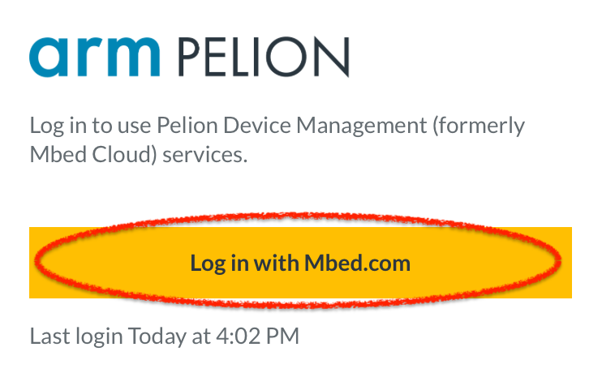

さらに画面が遷移し、Pelion Portal のコンソール画面がでてきますが、ここでライセンス条項への同意が必要になります。

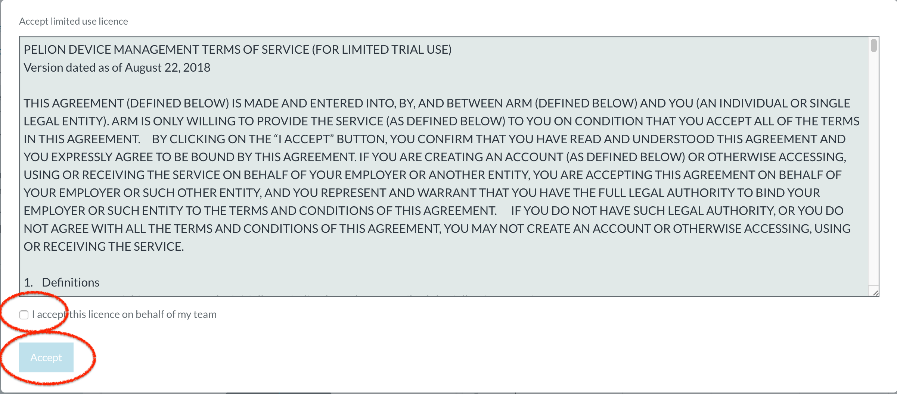

同意する場合は *I accept this license on behalf of my team* にチェックを入れて、*Accept* ボタンをクリックしてください。

完了したら Device Management Portal のウィンドウは閉じて構いません。


## プラットフォームを追加する

開発ボード（プラットフォーム）として今回使用するSeeed Wio 3Gをアカウントに追加します。次のいずれかの方法で登録してください。

### 手元のボードを使って登録

Mbed.com にログインした状態で以下の作業を行います。

1. パソコンと手元のボードを USB ケーブルで接続してください。ボードが USB ドライブとして認識されます。 
1. USB ドライブの中にある `MBED.HTM` をブラウザで開いてください。自動的にボードがアカウントに追加されます。

### サイトにアクセスして登録

次のページを開いてください。

[https://os.mbed.com/platforms/Seeed-Wio-3G/](https://os.mbed.com/platforms/Seeed-Wio-3G/)

画面右にある **Add to your Mbed Compiler** をクリックしてください。

クリックすると追加処理が行われ、完了すると *Platform 'Seeed Wio 3G' is now added to your account!* と表示されます。


# プログラムをビルドして、実行してみる


**このパートは、Mbedを使ったことがある方でもスキップをしないでください。**


## プロジェクトをインポートする

オンラインコンパイラのワークスペースにプロジェクトをインポートします。Mbed サイトのログインした状態で、次のページの右にある黄色いボタン *Import into Compiler* をクリックしてください。

[https://os.mbed.com/teams/Seeed/code/Wio_3G-example-sd-driver/?platform=Seeed-Wio-3G](https://os.mbed.com/teams/Seeed/code/Wio_3G-example-sd-driver/?platform=Seeed-Wio-3G)


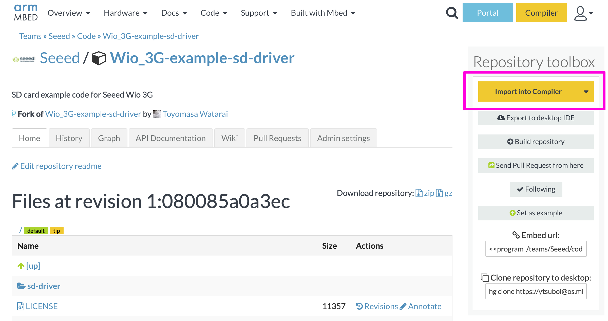

*Import into Compiler* ボタンをクリックするとオンラインコンパイラに画面が遷移します。インポートを確認するダイアログがでてくるので、*Import* ボタンをクリックしてインポートします。この際、 *Update all libraries to the latest revision* は **チェックしないでください** 。_（動作することを確認済みのバージョン構成でワークショップを進めていただきたいからです。）_

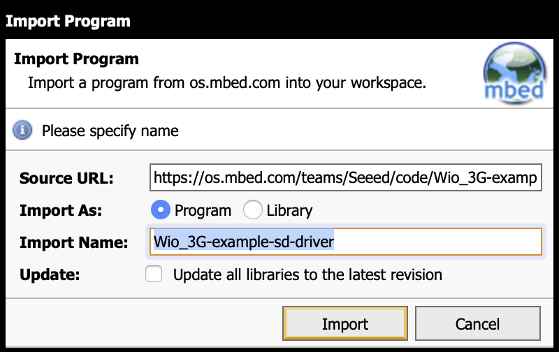

## ソースコードを編集する

ソースコードの編集の練習をしてみましょう。

プログラムワークスペースに`Wio_3G-example-sd-driver`というプログラムができています。プログラム名をダブルクリックするか、プログラム名の横の`+`をクリックしてプログラムを開きます。すると`main.cpp`がありますので、ファイル名をダブルクリックして開いてください。

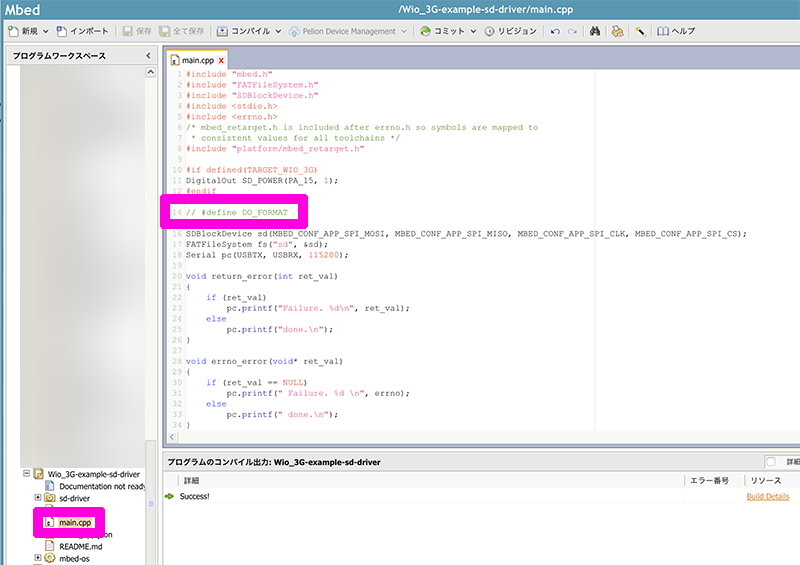

main.cppの14行目に

```
// #define DO_FORMAT
```

というコメントアウトがあります。この行を編集して、以下のようにアンコメントします。

```
#define DO_FORMAT
```

## プログラムをビルドする

プログラムをビルドする準備ができたので、オンラインコンパイラ上部にある *コンパイル* ボタンをクリックしてビルドを開始します。コンパイルする前に、ターゲットのプラットフォームがSeeed Wio 3Gであることを確認しましょう。オンラインコンパイラの画面右上に`Seeed Wio 3G`と表示されているのが正です。

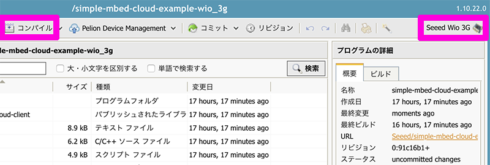

ビルドが完了すると、ファームウェアバイナリファイル `(プロジェクト名).bin` がダウンロードされます。


## ボードとパソコンを接続する

ボードとパソコンを USB ケーブルで接続します。Windows 8以前のWindowsでは、[Windows serial driver](https://os.mbed.com/docs/v5.9/tutorials/windows-serial-driver.html)が必要です。


## シリアルモニタを接続する

ターミナルソフトを起動し、ボードと接続します。シリアル通信のパラメータは、以下の通りです。

|項目|値|
--|--
|ボーレート|115200|
|データビット|8ビット|
|パリティ|なし|
|ストップビット|1|
|フローコントロール|なし|

受信の改行コードは、`LF`にしておいてください。

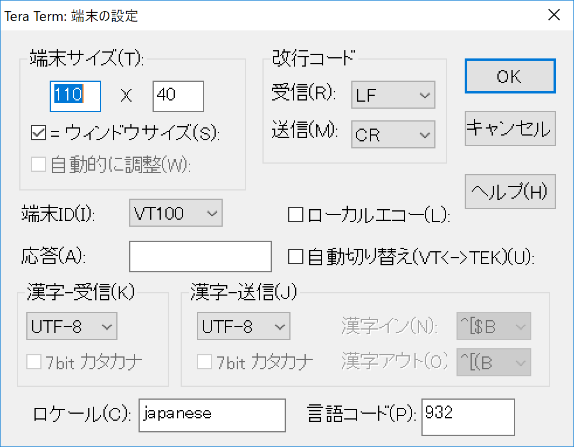

## プログラムをマイコンに書き込む

ボードが `DAPLINK` という名前の USB ドライブとして認識されているはずです。

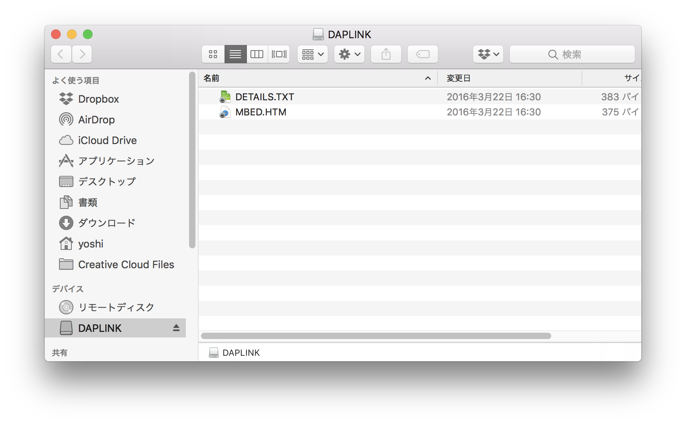

ドライブの中には `DETAILS.TXT` と `MBED.HTM` というファイルがあるはずです。同じ場所に先ほどダウンロードしたファームウェアをコピーしてください。そうすると、ボード上のSTM32F4にファームウェアが書き込まれます。

ファイルのコピーが終わったら、シリアルモニタが開いていることを確認した上で、ボード上の `BT` ボタン（リセットスイッチ）を押してください。Wio 3Gがリセットされ、プログラムの実行が開始されます。

**ここまでが標準的なMbedのプログラム開発と実行のプロセスです。**


# プログラムを作成する

Pelion Device Management と連携するために必要な Pelion Device Management Client を含むファームウェアを作成し、IoT デバイスに適用します。

## プロジェクトをインポートする

オンラインコンパイラのワークスペースにプロジェクトをインポートします。Mbed サイトのログインした状態で、次のページの右にある黄色いボタン *Import into Compiler* をクリックしてください。

[https://os.mbed.com/teams/Seeed/code/simple-mbed-cloud-example-wio_3g/?platform=Seeed-Wio-3G](https://os.mbed.com/teams/Seeed/code/simple-mbed-cloud-example-wio_3g/?platform=Seeed-Wio-3G)

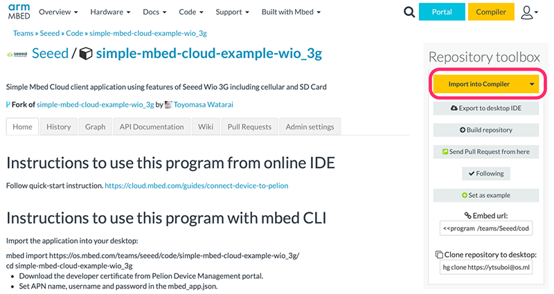

*Import into Compiler* ボタンをクリックするとオンラインコンパイラに画面が遷移します。インポートを確認するダイアログがでてくるので、*Import* ボタンをクリックしてインポートします。この際、 *Update all libraries to the latest revision* は **チェックしないでください** 。

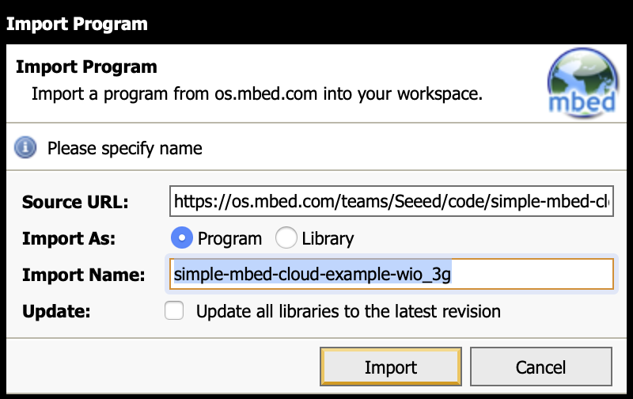


## アクセスポイント名（APN）を設定する

IoT デバイスが接続する Wi-Fi  アクセスポイントの情報を設定します。プロジェクトのルートにあるファイル `mbed_app.json` を開き、`target_overrides`の`WIO_3G`用の設定のある55〜57行目を編集してAPNを指定します。

このワークショップでは、SORACOMのグローバル向けAir SIMを使用しています。ですので、ここではSORACOMのAPNを指定します。当初は次の様になっています。

```
            "apn"                                   : "\"apn\"",
            "username"                              : "\"username\"",
            "password"                              : "\"password\""
```

これを下記の様に編集します。

```
            "apn"                                   : "\"soracom.io\"",
            "username"                              : "\"sora\"",
            "password"                              : "\"sora\""
```

文字列の先頭と最後にエスケープされた引用符 `\"` が必要ですのでご注意ください。

編集を終えたら、保存を行ってください。

## 開発者用証明書を作成する

IoT デバイス認証のための証明書情報等を含むファイルを生成します。オンラインコンパイラで画面上部にある *Pelion Device Management* メニューを展開し、*Manage Connect Certificates* をクリックします。

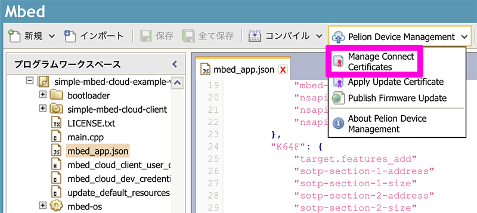

証明書を選択するダイアログが出てきますが、初回は利用できる証明書がまだありません。右上にある *Create* ボタンをクリックして証明書を作成します。

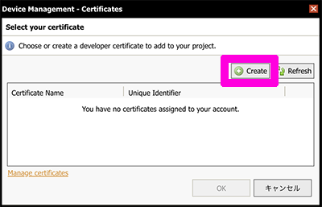

証明書を区別するために証明書につける名前を入力して、 *OK* ボタンをクリックしてください。

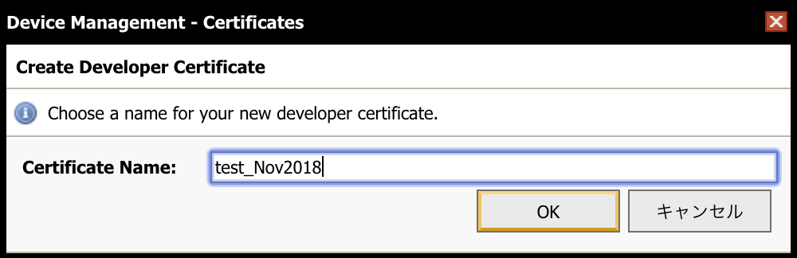

入力した名前で証明書が作成されているので、それを選択して *OK* ボタンをクリックします。

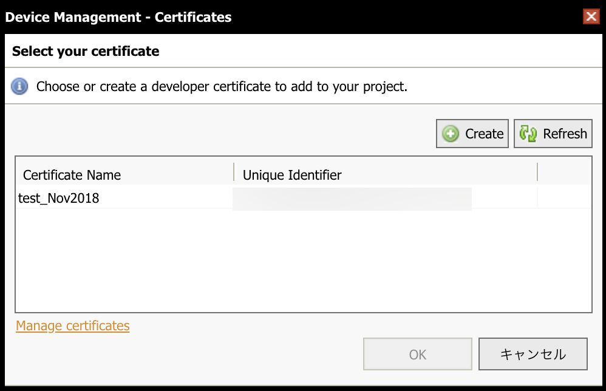

続いて `mbed_cloud_dev_credentials.c` ファイルを上書きしても良いか確認のダイアログが出てきますので、*OK* ボタンをクリックしてください。これで開発者用証明書などが `mbed_cloud_dev_credentials.c` に追加されます。

## アップデート用証明書等を作成する

_3G回線を使ったOTAアップデートには、25分程度の時間を要しますので、このハンズオンでは実行しません。この項は参考のために記述をしています。（スキップしても問題無くハンズオンを終えることができます。）_

ファームウェアの OTA アップデート時に、ダウンロードしたファームウェアを検証するための証明書と秘密鍵を生成します。

オンラインコンパイラで画面上部にある *Pelion Device Management* メニューを展開し、*Apply Update Certificate* をクリックします。

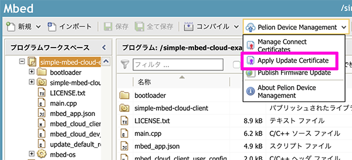

確認画面が出てきますので *Create* ボタンをクリックしてください。

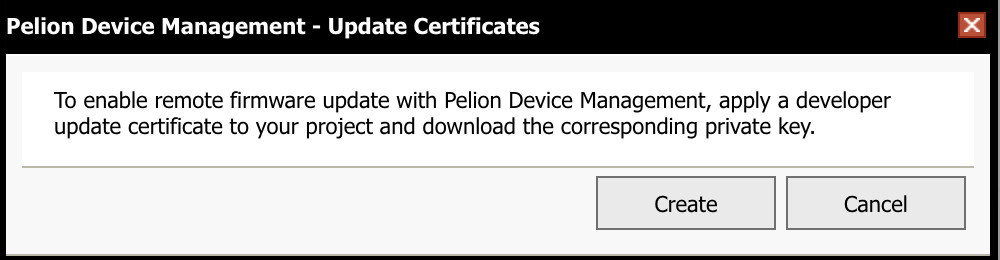

`update_default_resources.c` と `update_certificate.pem` を上書きする旨の確認ダイアログが出てきますので、こちらも *Create* ボタンをクリックしてください。ファイルが生成され上書きされます。

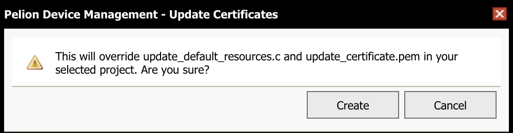

続いて、アップデート用ファームウェアを署名するための秘密鍵をダウンロードするダイアログが出てきますので *Download Private Key* ボタンをクリックして秘密鍵ファイルをダウンロードします。 **この秘密鍵は他の人と共有したりせず安全な場所に保管してください** 。あとで使用します。

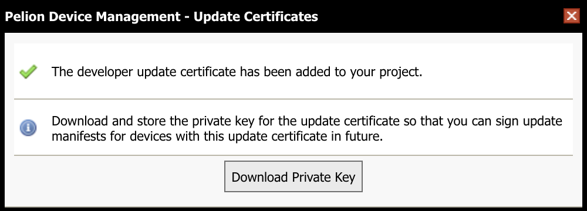


## プログラムをビルドする

プログラムをビルドする準備ができたので、オンラインコンパイラ上部にある *コンパイル* ボタンをクリックしてビルドを開始します。コンパイルする前に、ターゲットのプラットフォームがSeeed Wio 3Gであることを確認しましょう。オンラインコンパイラの画面右上に`Seeed Wio 3G`と表示されているのが正です。


ビルドが完了すると、ファームウェアバイナリファイル `(プロジェクト名).bin` がダウンロードされます。


## ボードとパソコンを接続する

ボードとパソコンを USB ケーブルで接続します。 


## シリアルモニタを接続する

ターミナルソフトを起動し、ボードと接続します。シリアル通信のパラメータは、以下の通りです。

|項目|値|
--|--
|ボーレート|115200|
|データビット|8ビット|
|パリティ|なし|
|ストップビット|1|
|フローコントロール|なし|

## ファームウェアを書き込む

ボードが `DAPLINK` という名前の USB ドライブとして認識されているはずです。


ドライブの中には `DETAILS.TXT` と `MBED.HTM` というファイルがあるはずです。同じ場所に先ほどダウンロードしたファームウェアをコピーしてください。そうすると、ボード上のSTM32F4にファームウェアが書き込まれます。


## IoT デバイスを起動する

ファームウェアの書き込みが完了すると、 IoT デバイスがリセットされて書き込んだファームウェアが起動します。以下は起動時のシリアル通信ログの一例です。環境によって一部の表示が異なります。

```
[BOOT] Mbed Bootloader
[BOOT] ARM: 00000000000000000000
[BOOT] OEM: 00000000000000000000
[BOOT] Layout: 0 80075F0
[BOOT] Active firmware integrity check:

[BOOT] [+++                                                                   ]
[BOOT] [++++++                                                                ]
[BOOT] [++++++++                                                              ]
[BOOT] [+++++++++++                                                           ]
[BOOT] [+++++++++++++                                                         ]
[BOOT] [++++++++++++++++                                                      ]
[BOOT] [++++++++++++++++++                                                    ]
[BOOT] [+++++++++++++++++++++                                                 ]
[BOOT] [+++++++++++++++++++++++                                               ]
[BOOT] [++++++++++++++++++++++++++                                            ]
[BOOT] [++++++++++++++++++++++++++++                                          ]
[BOOT] [+++++++++++++++++++++++++++++++                                       ]
[BOOT] [+++++++++++++++++++++++++++++++++                                     ]
[BOOT] [++++++++++++++++++++++++++++++++++++                                  ]
[BOOT] [+++++++++++++++++++++++++++++++++++++++                               ]
[BOOT] [+++++++++++++++++++++++++++++++++++++++++                             ]
[BOOT] [++++++++++++++++++++++++++++++++++++++++++++                          ]
[BOOT] [++++++++++++++++++++++++++++++++++++++++++++++                        ]
[BOOT] [+++++++++++++++++++++++++++++++++++++++++++++++++                     ]
[BOOT] [+++++++++++++++++++++++++++++++++++++++++++++++++++                   ]
[BOOT] [++++++++++++++++++++++++++++++++++++++++++++++++++++++                ]
[BOOT] [++++++++++++++++++++++++++++++++++++++++++++++++++++++++              ]
[BOOT] [+++++++++++++++++++++++++++++++++++++++++++++++++++++++++++           ]
[BOOT] [+++++++++++++++++++++++++++++++++++++++++++++++++++++++++++++         ]
[BOOT] [++++++++++++++++++++++++++++++++++++++++++++++++++++++++++++++++      ]
[BOOT] [++++++++++++++++++++++++++++++++++++++++++++++++++++++++++++++++++    ]
[BOOT] [+++++++++++++++++++++++++++++++++++++++++++++++++++++++++++++++++++++ ]
[BOOT] [++++++++++++++++++++++++++++++++++++++++++++++++++++++++++++++++++++++]
[BOOT] SHA256: 24918F59247531A5BB926E06BA0E068CD77FE937B6A11DE4C727175D88BE0BFA
[BOOT] Version: 1543758598
[BOOT] Slot 0 is empty
[BOOT] Active firmware up-to-date
[BOOT] Application's start address: 0x8010400
[BOOT] Application's jump address: 0x8011065
[BOOT] Application's stack address: 0x20030000
[BOOT] Forwarding to application...
Œ.p.‡Starting Simple Pelion Device Management Client example
Connecting to the network...
```

ここで、セルラー網を通じてインターネットに接続するため、数秒〜数十秒の時間を要します。

```
Connected to the network successfully. IP address: 10.153.96.76
[SMCC] Autoformatting the storage.
[SMCC] Reset storage to an empty state.
[SMCC] Starting developer flow
Initialized Pelion Client. Registering...
Initialized Pelion Client. Registering...
Simulated button clicked 1 times
Simulated button clicked 2 times
Simulated button clicked 3 times
Simulated button clicked 4 times
Simulated button clicked 5 times
Simulated button clicked 6 times
Simulated button clicked 7 times
Simulated button clicked 8 times
Connected to Pelion Device Management. Endpoint Name: 01676f3490c8000000000001001003e2
Simulated button clicked 9 times
```

最後に `Connected to Pelion Device Management. Endpoint Name: XXXXXXXXXXXXXXXXXXXXXX` が表示されれば Pelion Device Management への接続が成功しています。 `XXXXXXXXXXXXXXXXX` （上の表示では`01676f3490c8000000000001001003e2` ）はエンドポイント名（デバイスID）です。後ほど使用しますのでメモしておいてください。

もしファームウェア書き込み後に何も表示されない場合は、ボード上の `BT` ボタン（リセットスイッチ）を押してください。Wio 3Gがリセットされます。


## Pelion Device Management Portal で確認する

Pelion Device Management Portal 上で、デバイスツリーにデバイスが登録されていることを確認してみましょう。次のページを開いてください。

[https://portal.mbedcloud.com/](https://portal.mbedcloud.com/)

途中、ログインを求められたときは`Mbed.com accountでログイン`をクリックして、

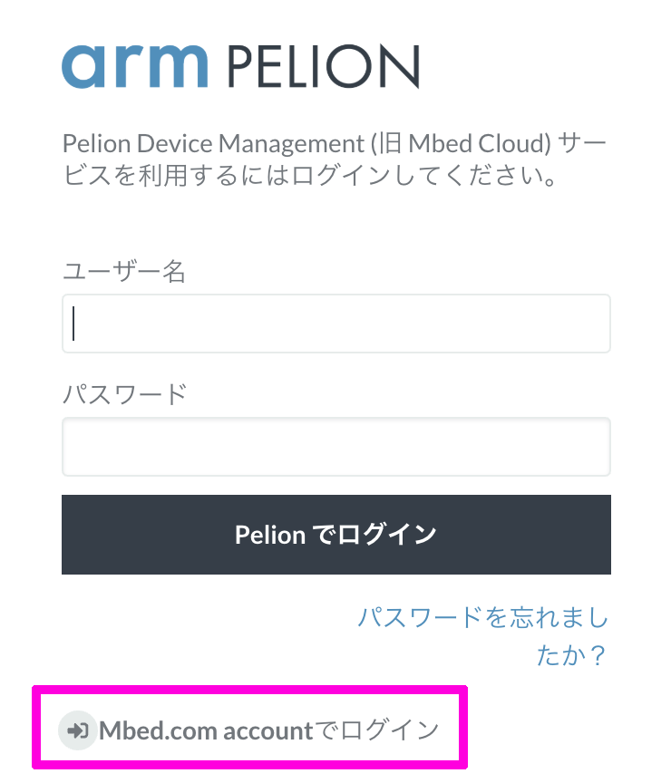

次に出てくる *Log in with Mbed.com* をクリックしてください。

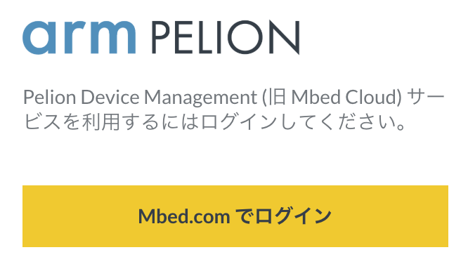


ログインが完了するとダッシュボードが表示されます。画面左のメニューの`デバイスディレクトリ`をクリックするとデバイス一覧が表示されます。今回は先ほど接続したデバイスが表示されるはずです。

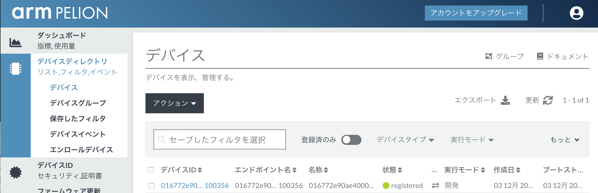

リストに表示されているデバイス名をクリックするとデバイスの詳細画面が表示されます。デバイス詳細の表示の中にある`リソース`タブをクリックしてください。

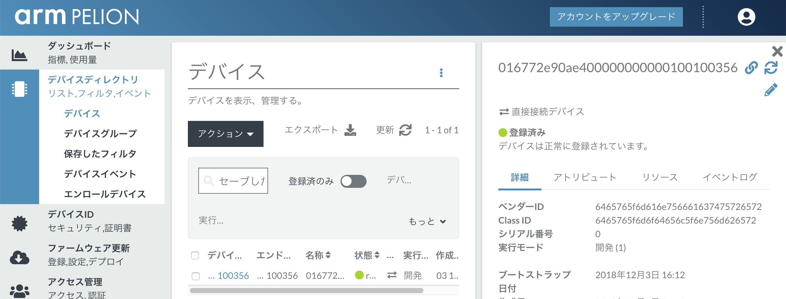

IoT デバイスに登録されているリソース一覧が表示されます。この中から `button_count` ( `/3200/0/5501` ) というリソースを探し、クリックしてください。

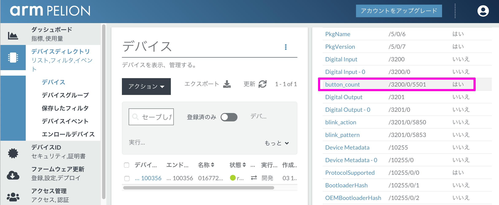

クリックすると、モニタ画面が表示され、リソースの状態をモニタすることができます。 サンプルコードでシミュレートされたボタン入力により、Valueが増えていく様子が確認していただけます。

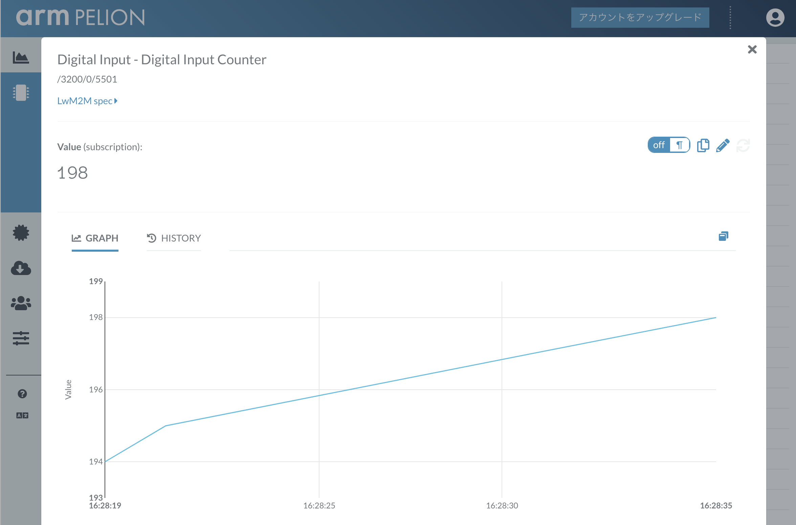


# おまけ

ここまで順調に進んできて時間が余った方は、シミュレートされたボタン操作ではなく、実際にボタンを接続して、このボタン操作をPelion Device Managementに送信してみましょう。

まず、GroveのボタンをD38のGrove端子に接続してください。

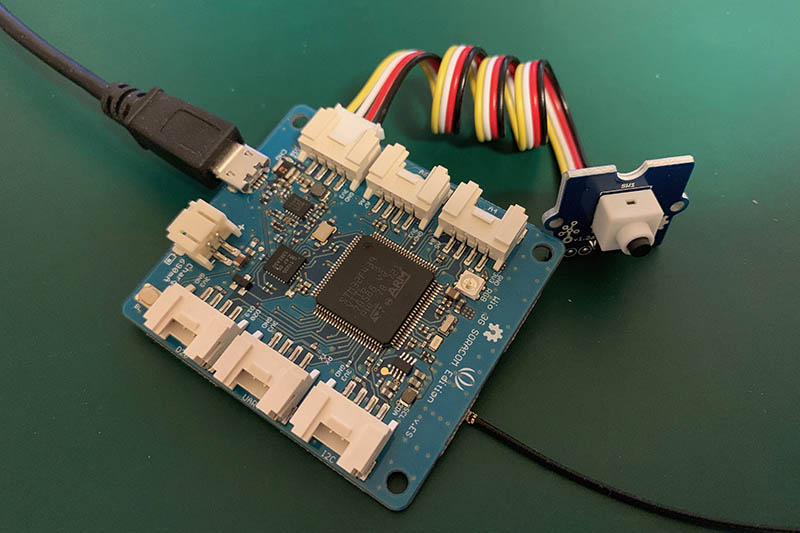

GroveのボタンをD38のコネクタに接続することで、D38ピンにプルダウンされたスイッチを取り付けることができます。ピン変化割り込みである[InterruptIn](https://os.mbed.com/docs/latest/apis/interruptin.html)を使う事で、簡単にボタン押下が得られるようになります。

```cpp
    InterruptIn userButton(D38);
```

