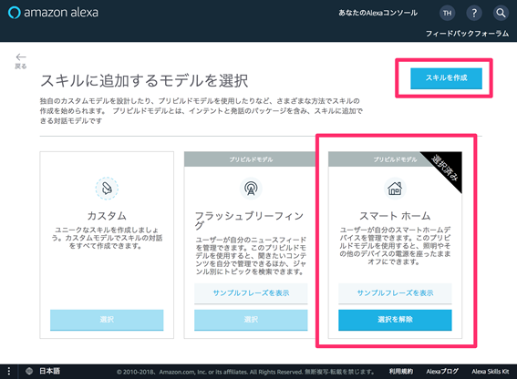

# Wio Node + Alexa ハンズオン

### 事前準備

1. Webブラウザー (Chrome 推奨)
1. 開発者コンソールアカウント
1. AWSアカウント
1. Alexaアプリ (iPhone/Android)

### サンプルスマートホームスキルを作る

一連の作業には開発者コンソール (https://developer.amazon.com/ )と AWS マネジメントコンソール ( https://aws.amazon.com/ ) を使います。それぞれのコンソールをあらかじめブラウザーで開いておきます。

まずは開発者コンソール (http://developer.amazon.com ) での作業です。

[ALEXA SKILL KIT] を開きます。Alexaスキルの開発画面に移動します。


[スキルの作成] ボタンを押して新規スキルの作成を開始します。


スキルの名前（「マイスマートホーム」など任意）を設定、言語設定で「日本語」を選び、[次へ] のボタンを押します。


スキルのモデルで「スマートホーム」を選択します。 [スキルの作成] を押してスキルを作成します。



[スキルの作成]が成功すると、スキルの処理を行うエンドポイントの設定画面に切り替わります。この設定を行うには、まずスキルの処理を行う Lambda 関数が作られている必要があります。


ここからはAWSマネージメントコンソールで作業をします。 AWS サービスから「Lambda」を選びます。エンドポイントは「オレゴン」を選びます。


Lambda の管理画面で [関数の作成] ボタンを押します。


それぞれの項目を以下のように設定します。（「名前」に設定するLambdaの名前は任意）


「コードエントリタイプ」で 「.ZIP ファイルをアップロード」を選択し、サンプルコード SmartHomeSkillSample.zip をアップロードします。


ソースコードの次の箇所を対象 WioNode を操作するためのURLに変更します

```python
　　　　　　：　　　　　　　　　　：

if request_name == "TurnOn":
	value = "ON"
	status_code, body = sendHTTPRequest("https:// ノードをONにするURLを設定","POST")
else:
	value = "OFF"
	status_code, body = sendHTTPRequest("https:// ノードをOFFにするURLを設定","POST")

　　　　　　：　　　　　　　　　　：

if request_name == "ReportState":
	status_code, body = sendHTTPRequest("https:// ノードの状態を取得するURLを設定")

　　　　　　：　　　　　　　　　　：

```

基本設定のタイムアウトは 7 秒に設定します


トリガーの追加から「Alexa Smart Home」を選び、Alexa Smart Home 
を Lambda のトリガーとして追加します。トリガーの設定に スキルIDを設定します。スキルID は開発者コンソール、開発中のスキルのサービスエンドポイントの設定画面で確認することができます。

設定したら、[追加] ボタンを押し、次に右上の [保存] ボタンを押して設定を保存します。


開発者コンソールに戻り 「2. スマートホームのサービスエンドポイント」の「デフォルトのエンドポイント」を設定します。ここには先ほど作成した Lambda のリソース名（ARN）を設定します。ARN は AWS マネージメントコンソール、右上から確認することができます。


次に Alexa のユーザーとスマートホームデバイスのユーザーを紐づけるための仕組みであるアカウントリンクの設定に進みます。

本来スマートホームデバイスのサービスプロバイダーが提供する OAuth2.0 サーバーに関する情報を設定するのですが、今回は Amazon が提供する Login with Amazon という OAuth 2.0 を使って設定を進めます。

参考：  
Alexaのアカウントリンクについて  
https://developer.amazon.com/ja/docs/custom-skills/link-an-alexa-user-with-a-user-in-your-system.html

Login with Amazon について  
https://developer.amazon.com/ja/docs/login-with-amazon/web-docs.html

Webブラウザーで開発者コンソールをもう一つ開き、「アプリ&サービス」の「Amazon でログイン」を選びます。[Create a New Security Profile] ボタンを押して、新規 Login with Amazon の設定を開始します。


必須入力項目にそれぞれ任意の情報を入力し、[Save]ボタンを押して設定を保存します。


ギアのアイコンをクリック、作成した設定を開きます。


「General」タブを開き Client ID、Client Secret を確認します。ここで表示される文字列をスキルに設定することになるので、テキストファイルなどにそれぞれの文字列をコピー&ペーストしておくと良いでしょう。

スマートホームスキルを開発している開発者コンソールに戻り、「アカウントリンク」タブを開きます。

それぞれ次のように入力します

認証画面のURI：		https://www.amazon.com/ap/oa  
アクセストークンのURI：	https://api.amazon.com/auth/o2/token  
クライアント ID：		Login with Amazon で確認した Client ID  
クライアントシークレット：Login with Amazon で確認した Client Secret  
クライアントの認可方法：	HTTP Basic認証  
スコープ：		profile


「リダイレクト先のURL」に記載の 3 つの URL を Login with Amazon の Allowed Return URLs に設定します。


それぞれ設定を保存します。

以上でスキルは完成しました。

### サンプルスキルの動作を確認する

Alexaアプリで作成したスキルを有効にします。

https://alexa.amazon.co.jp/

作成したスキルは[有効なスキル]の「DEV スキル」タブから確認できます。


スキルを有効にして、アカウントリンクを行います。ここは本来、スマートホームデバイスを提供するサービスプロバイダーに設定した ID、パスワードを入力しますが、今回はアカウントリンクに Login with Amazon を使ったので、Amazon アカウントにログインする際の ID、パスワードを入力します。

アカウントリンクに成功すると「端末の検出」ダイアログが表示されます。ここで [端末の検出] から、デバイスの検出を開始するか、Alexaデバイスに「アレクサ、デバイスを見つけて」と話しかけます。


検出されたデバイスは Alexa アプリ「スマートホーム」タブから確認できます。


Alexa デバイスに次のように発話することで WioNodeデバイスを操作できます。

「アレクサ、スイッチをつけて」  
「アレクサ、スイッチをオフ」

Alexaアプリからもデバイスの操作、状態の確認ができます。


### サンプルプログラムの実装の確認

#### デバイスの検出コードを確認

スキルに対してデバイスの検出リクエストが送られると、スキルロジックはデバイスの一覧を返します。本来アクセストークンからユーザーを特定し、該当ユーザーの持っているデバイスの情報を提供する必要がありますが、サンプルプログラムでは、サンプルコードの中に固定で定義されたデバイス情報で応答を行なっています。
固定のデバイス情報は次に定義されています。

```python
　　　　：　　　　　　　　　　　　　　：

SAMPLE_APPLIANCES = [
	{
		"capabilities": [
			{
				"type": "AlexaInterface",
				"interface": "Alexa.EndpointHealth",
				"version": "3",
				"properties": {
					"supported":[
						{ "name":"connectivity" }
					],
					"proactivelyReported": False,
					"retrievable": True
				}
			},
			{
				"type": "AlexaInterface",
				"interface": "Alexa.PowerController",
				"version": "3",
				"properties": {
					"supported": [
						{ "name" : "powerState" }
					],
					"proactivelyReported": False,
					"retrievable": True
				}
			}
		],
		"description": "スマートデバイスカンパニーのスマートプラグ",
		"displayCategories": [
			"SWITCH"
		],
		"endpointId": "111-11111-11111-1001",
		"friendlyName": "スイッチ",
		"manufacturerName": "スマートデバイスカンパニー"
	}
]
　　　　：　　　　　　　　　　　　　　：
```

デバイス検出処理の実装方法の詳細は次を確認してください。  
https://developer.amazon.com/ja/docs/device-apis/alexa-discovery.html

#### デバイスの操作コードを確認

ユーザーが 「ライトをつけて」などの発話を行い、該当デバイス名（この場合「ライト」）が自身のスキルが提供するデバイスだった時、Alexaはスキルに操作インターフェースのディレクティブとしてこれを送り、処理することを要求します。

ディレクティブの処理ではアクセストークンからユーザーを特定し、endpointId から操作対象のデバイスを特定し、該当のデバイスを操作、結果を返します。

サンプルプログラムでは、アクセストークン（ユーザー）、endpointId に関係なく、固定のデバイスを操作させています。

```python

　　　　：　　　　　　　　　　　　　　：

def handleNonDiscovery(request):
	request_namespace = request["directive"]["header"]["namespace"]
	request_name = request["directive"]["header"]["name"]

	if request_namespace == "Alexa.PowerController":

		#Do action

		if request_name == "TurnOn":
			value = "ON"
			status_code, body = sendHTTPRequest("https:// ノードをONにするURLを設定","POST")
		else:
			value = "OFF"
			status_code, body = sendHTTPRequest("https:// ノードをOFFにするURLを設定","POST")

		#Do action end


		if (status_code == 200 and body["result"].upper() == "OK"):
			response = {
				"context": {
					"properties": [
						{
							"namespace": "Alexa.PowerController",
							"name": "powerState",
							"value": value,
							"timeOfSample": get_utc_timestamp(),
							"uncertaintyInMilliseconds": 500
						}
					]
				},
				"event": {
					"header": {
						"namespace": "Alexa",
						"name": "Response",
						"payloadVersion": "3",
						"messageId": get_uuid(),
						"correlationToken": request["directive"]["header"]["correlationToken"]
					},
					"endpoint": {
						"scope": {
							"type": "BearerToken",
							"token": "access-token-from-Amazon"
						},
						"endpointId": request["directive"]["endpoint"]["endpointId"]
					},
					"payload": {}
				}
			}
			return response
		else:
			## TODO: error response
			pass

　　　　：　　　　　　　　　　　　　　：
```

各操作インターフェースとディレクティブについて詳細は次を確認してください  
https://developer.amazon.com/ja/docs/device-apis/message-guide.html

#### 状態レポートのコードを確認

Alexa はユーザーデバイスの状態を把握し、その状態情報を様々な形で利用します。わかりやすい一つの例は Alexa アプリでのデバイスの状態の表示です。


デバイスの状態は Alexa からスキルロジックへの問い合わせに対応する形で伝えるクエリー型の状態通知の仕方と、状態の変化をデバイスのクラウドロジックから Alexa サービスに伝えるプロアクティブ型の方法の２つがあります。

クエリー型の状態通知は、ReportState ディレクティブを受け取った時、アクセストークンからユーザーを特定し、endpointId から操作対象のデバイスを特定し、該当のデバイスを操作、結果を返します。

サンプルプログラムでは、アクセストークン（ユーザー）、endpointId に関係なく、固定のデバイスの状態を返しています。

```python

　　　　：　　　　　　　　　　　　　　：

	elif request_namespace == "Alexa":
		if request_name == "ReportState":
			status_code, body = sendHTTPRequest("https:// ノードの状態を取得するURLを設定")
			if (status_code == 200):
				value = "ON" if body["onoff"] == 1 else "OFF"
				response = {
					"context": {
						"properties": [
							{
								"namespace": "Alexa.EndpointHealth",
								"name": "connectivity",
								"value": {
									"value": "OK"
								},
								"timeOfSample": get_utc_timestamp(),
								"uncertaintyInMilliseconds": 200
							},
							{
								"namespace": "Alexa.PowerController",
								"name": "powerState",
								"value": value,
								"timeOfSample": get_utc_timestamp(),
								"uncertaintyInMilliseconds": 500
							}
						]
					},
					"event": {
						"header": {
							"namespace": "Alexa",
							"name": "StateReport",
							"payloadVersion": "3",
							"messageId": get_uuid(),
							"correlationToken": request["directive"]["header"]["correlationToken"]
						},
						"endpoint": {
					 		"scope": {
								"type": "BearerToken",
						 		"token": "access-token-from-Amazon"
					 		},
					 		"endpointId": request["directive"]["endpoint"]["endpointId"]
						},
						"payload": {}
					}
				}
				return response
			else:
				## TODO: error response
				pass
```

プロアクティブ型の状態レポートは今回は実装を完了させていません。  
次を参考に実装を完成させることができるかと思います。  
https://amzn.to/2HAOMvF

### 挑戦してみましょう

-	Alexa の「定形アクション」機能を確認。
-	一つのスキルで複数のデバイスを扱えるようにしましょう。例えば Win Node の PORT0、PORT1 それぞれのポートにつながっているデバイスをコントロールできるようにする。
-	Alexa.PowerController に対応できるようにして見る
-	アカウントリンクを実装し、各ユーザーが登録したデバイスのディスカバリ、コントロールができるようにする
-	プロアクティブ型の状態レポートを実装する

### 参考 Work with Alexa について

スマートホームスキルには Work with Alexa という認定プログラムがあります。
Work with Alexa 認定を受けると、対象スマートホーム製品に 「Work with Alexa」バッジをつけることができるなど多くのプロモーション効果が期待できます。

スマートホームスキルにはスマートホームデバイスの状態の変化をAlexaサービスに通知する仕組みがあります。この仕組みの実装は Work with Alexa (WWA) の認定を受けるために必須です。
Work with Alexa 認定を受けるにはスキルは互換性テストを受ける必要があり、エラー系の処理も含め正しく実装されていることに加えプロアクティブ型の状態レポートも正しく実装されている必要があります。これらも含めたスキルの

参考：  
https://amzn.to/2HAOMvF

