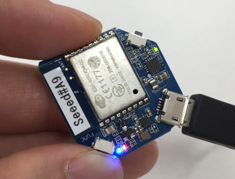

# Wio Node + Alexa ハンズオン

## Wio Nodeの部

### Wi-Fiアクセスポイントに接続

Wio Nodeを設定するスマートフォンを、会場に用意されたWi-Fiアクセスポイントに接続してください。  
（自動接続にしておく必要があります。）

### Wioサーバーにログイン

App Storeで`Wio Link`アプリ(以降、Wioアプリ)を検索して、インストールしてください。

Wioアプリを起動して、`SIGN UP`タブを選択、メールアドレスとパスワードを入力して、`SIGN UP`ボタンをクリックしてください。  
講師からWioサーバーの指示があった場合は、ここでServer Locationを変更しておいてください。

### Wio Nodeデバイスを追加

Wioアプリの`Device List`画面で、右上のプラスマークをクリックしてください。  
そして、`Wio Node`をクリックしてください。

すると、`Setup Your Wio Node`画面が表示されます。

Wio Nodeの`FUNC`ボタンを長押しして、青色LEDがフワフワと点滅することを確認してください。  
（ここでは、Wio NodeがWi-Fiアクセスポイントとして動作するよう設定しています。）

Wioアプリの`Setup Your Wio Node`画面はそのままにしておいて、スマートフォンのWi-Fi設定画面でWio Nodeのアクセスポイント（'Wio_xxxxxx'という名称）に接続してください。

Wioアプリに戻って、`Goto wifi list`をクリックしてください。

会場に用意されたWi-Fiアクセスポイントを選択して、パスワードを入力、`Join`をクリックしてください。

Wio Nodeの名前（任意）を入力して、`Start Wio-ing'をクリックしてください。

追加したWio Nodeが一覧に表示されれば成功です。

### Wio NodeデバイスにLEDモジュールを追加

Wio Nodeをクリックしてください。Wio Nodeデバイスの画面になります。  
左コネクタの`SELECT`をクリックして、`OUTPUT`タブの`Generic Digital Output`をクリックしてください。  
左コネクタに電球マークが表示されていることを確認してから、`Update Firmware`ボタンをクリックしてください。
そして、`OK`をクリックしてください。

左コネクタに電球マークが表示されていて、下のボタンが`View API`と表示されていれば正常です。

Wio Nodeの電源（USBケーブル）を外して、左コネクタにGrove-LEDを接続、Wio Nodeの電源をつないでください。

Wioアプリの`View API`ボタンをクリックして、`.../GenericDOutD0/onoff/[onoff]?...`と書かれたセクションの`Test Request`に`1`を入力、`POST`ボタンをクリックしてください。  
すると、LEDが点灯します。  
`Test Request`に`1`を入力するとLED点灯、`Test Request`に`0`を入力するとLED消灯です。
点灯/消灯できるか試してください。

### パソコンからLEDを制御

パソコンのWebブラウザで、`(WioサーバーURL)/v1/node/resources?access_token=(アクセストークン)`を開いてください。  
`(WioサーバーURL)`はWioアプリのSetting画面に表示された値、`(アクセストークン)`はView API画面で表示されたaccess_tokenを入力してください。  
すると、WebブラウザにWioアプリのView APIと同じ画面が表示されます。
`.../GenericDOutD0/onoff/[onoff]?...`と書かれたセクションで、LEDを点灯/消灯できるか試してください。

